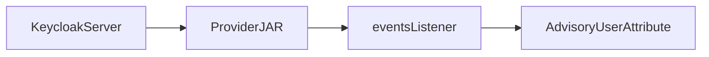
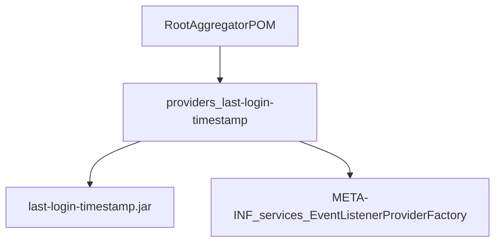
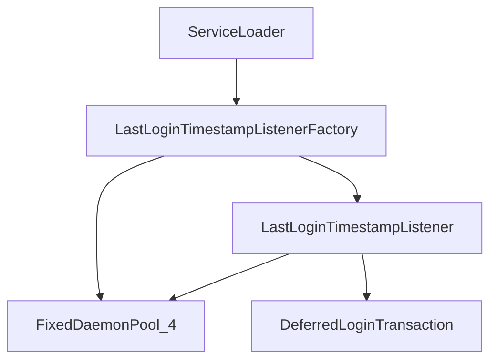
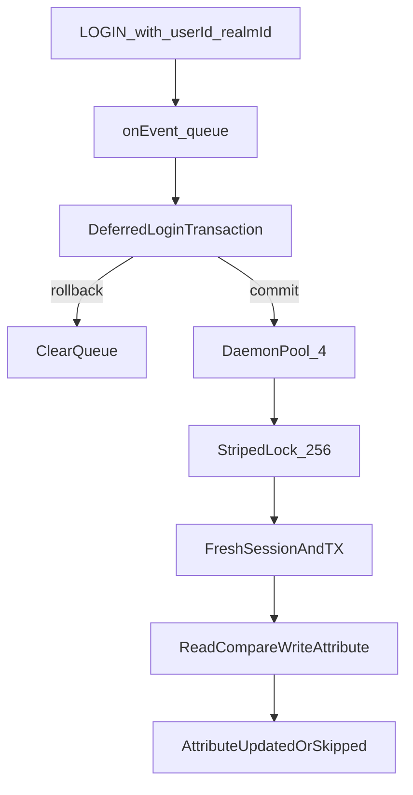

# Keycloak Providers architecture

This document gives the high-level system architecture of this Keycloak SPI
provider repository.

## Purpose and scope

This repo is a Maven multi-module collection of **Keycloak SPI provider JARs**.
Each module under `providers/` builds one deployable JAR that Keycloak loads
from its `providers/` directory. Providers compile against Keycloak server APIs
with Maven scope `provided`.

This file covers:

- Repository shape and module map
- How Keycloak discovers and runs a provider
- The last-login-timestamp event-listener data flow
- Contracts and limitations at a high level
- Local verification and agent layout

This file does **not** cover:

- Full build/install/enable steps — see [README.md](../../README.md) and
  [providers/last-login-timestamp/README.md](../../providers/last-login-timestamp/README.md)
- SPI change workflows — see [keycloak-spi-change](../skills/keycloak-spi-change/SKILL.md)
- Keycloak version matrix bumps — see [bump-keycloak-matrix](../skills/bump-keycloak-matrix/SKILL.md)
- Agent index — see [AGENTS.md](../../AGENTS.md)

## System context

Keycloak loads the provider JAR at server build/start time.
`ServiceLoader` discovers `EventListenerProviderFactory` implementations.
An administrator enables the listener on a realm.
On successful user login, the listener writes an advisory last-login attribute
on the user (epoch millis). Authentication is never blocked or rolled back by
that write.



## Repository shape

Root POM (`me.deangrant.keycloak:keycloak-providers`) is an aggregator
(`packaging` `pom`). Modules live under `providers/<name>/`. There are no Maven
profiles for Keycloak versions; the single override point is the root property
`keycloak.version`.

| Module | Artifact | SPI | Role |
| ------ | -------- | --- | ---- |
| `providers/last-login-timestamp` | `last-login-timestamp` | `eventsListener` | Record last successful `LOGIN` as a user attribute |

Keycloak artifacts (`keycloak-server-spi`, `keycloak-server-spi-private`,
`keycloak-core`) and JBoss Logging are **`provided`**. Override the compile/test
Keycloak version with `-Dkeycloak.version=<version>`.



## Provider map (last-login-timestamp)

| Type | Path | Role |
| ---- | ---- | ---- |
| Factory | [`LastLoginTimestampListenerFactory.java`](../../providers/last-login-timestamp/src/main/java/me/deangrant/keycloak/events/LastLoginTimestampListenerFactory.java) | SPI id, attribute-name config, background executor lifecycle |
| Listener | [`LastLoginTimestampListener.java`](../../providers/last-login-timestamp/src/main/java/me/deangrant/keycloak/events/LastLoginTimestampListener.java) | Filter LOGIN events, after-commit queue, attribute write |
| Registration | [`META-INF/services/...EventListenerProviderFactory`](../../providers/last-login-timestamp/src/main/resources/META-INF/services/org.keycloak.events.EventListenerProviderFactory) | `ServiceLoader` entry for the factory |

Provider ID: `last-login-timestamp`.
Default attribute: `lastLoginTimestamp` (stringified epoch milliseconds).



## Login update pipeline

[`LastLoginTimestampListener`](../../providers/last-login-timestamp/src/main/java/me/deangrant/keycloak/events/LastLoginTimestampListener.java)
runs these steps for each qualifying event:

1. Accept only `EventType.LOGIN` with non-null `userId` and `realmId`.
2. Queue the event on a deferred `AbstractKeycloakTransaction` enlisted with
   `enlistAfterCompletion`.
3. On login TX **rollback**, clear the queue (no write).
4. On login TX **commit**, submit one task per queued event to the factory’s
   4-thread daemon pool.
5. Under a **256-stripe** lock keyed by realm/user, open a fresh
   `KeycloakSession`/transaction and read-compare-write the attribute.
6. Replace the stored value only when it is missing, blank, non-numeric, or
   strictly older than `event.getTime()` (monotonic **per node**).
7. Catch all update failures and log at `WARN` on `org.keycloak.events`; never
   rethrow into the login path.

Admin events are ignored. Non-`LOGIN` user events are ignored.



## Contracts and limitations

| Contract | Meaning |
| -------- | ------- |
| Advisory attribute | Operational last-login signal; not a canonical audit trail |
| Non-blocking auth | Writes run after commit on a background pool |
| Best-effort | Failures are WARN-only; login still succeeds |
| Per-node monotonicity | Same-node RCW is ordered; cross-node DB races remain possible |
| LOGIN-only | `IMPERSONATE`, `CLIENT_LOGIN`, `REFRESH_TOKEN`, IdP variants, etc. do not update |
| Public session APIs | Fresh-session writes use public Keycloak APIs; no private helpers beyond the events SPI |

Federated users in READ_ONLY (or similar) storage may never receive the
attribute. The attribute may appear shortly after the login HTTP response
returns. See the provider README Limitations section for operator detail.

## Verification and agent layout

Toolchain: JDK **21**, Maven **3.9+**.

Local checks (CI parity):

```bash
mvn -B spotless:apply
mvn -B verify -DskipTests
mvn -B test
mvn -B test -Dkeycloak.version=26.4.7
```

`verify -DskipTests` runs Enforcer, Error Prone compile, and Spotless check.
Tests are unit-only (JUnit 5 + Mockito); there is no Testcontainers / Failsafe
IT suite. CI recompiles and tests against the Keycloak matrix listed in the root
README.

Agent support lives under `.agents/`:

- `rules/` — SPI, Java/Maven, docs-sync policy
- `skills/` — SPI change, matrix bump, Dependabot triage
- `commands/` — `/lint`, `/test`, `/matrix-test`, `/provider-readme`
- `hooks/` — destructive-git block and Spotless nudge
- `docs/` — this architecture file

See [AGENTS.md](../../AGENTS.md) for the full index.
